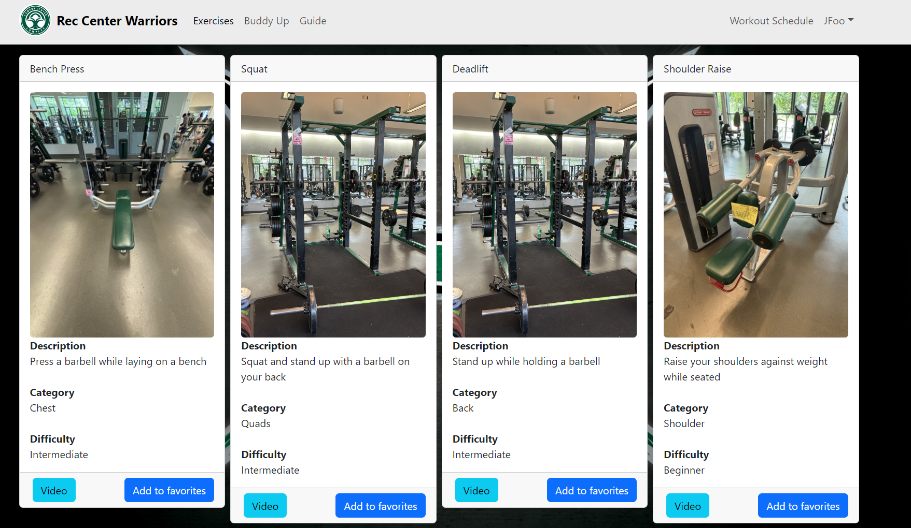

# Overview
Rec Center Warriors is a custom social platform tailored for the University of Hawaii at Manoa community, connecting both seasoned gym enthusiasts and those just starting their fitness journey. With features like Gym Buddy, users can create profiles, connect with friends, join groups, and share updates related to fitness and wellness. It's a supportive space where members can motivate each other, find workout partners, and engage in discussions about staying healthy

# Home Page

Sign up / login 

Logged in

# Exercises Page

This page provides the available exercises at the WRC and useful information about the purpose of them and how to perform them. 

# What I learned

Certainly, here's a more concise version:

Throughout our project's design process, I learned firsthand the critical role of software engineering principles like configuration management, design patterns, coding standards, and user interface frameworks. For example, we applied the MVC design pattern with Bootstrap to enable user interactions such as favoriting exercises and managing schedules. Collaboration was smooth thanks to configuration management, ensuring each team member's work didn't conflict with others'. Adhering to coding standards kept our codebase clear and readable, while leveraging UI frameworks streamlined interface development. These principles were essential in building a cohesive, functional application.
